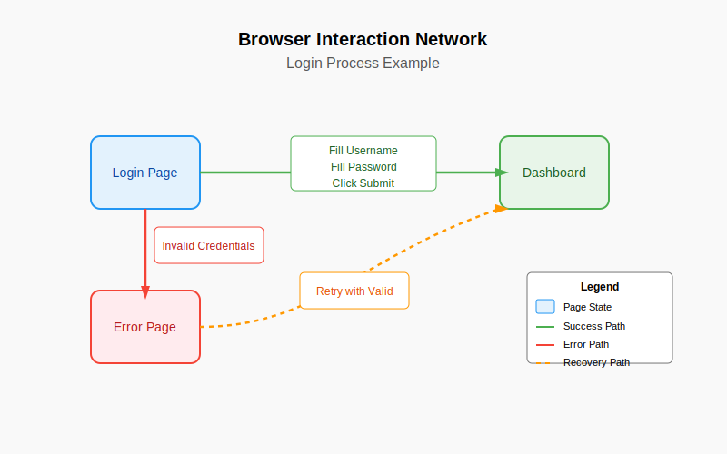
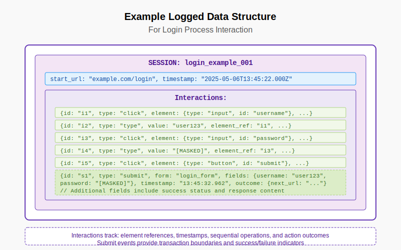
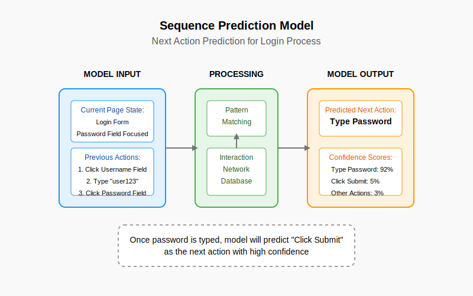
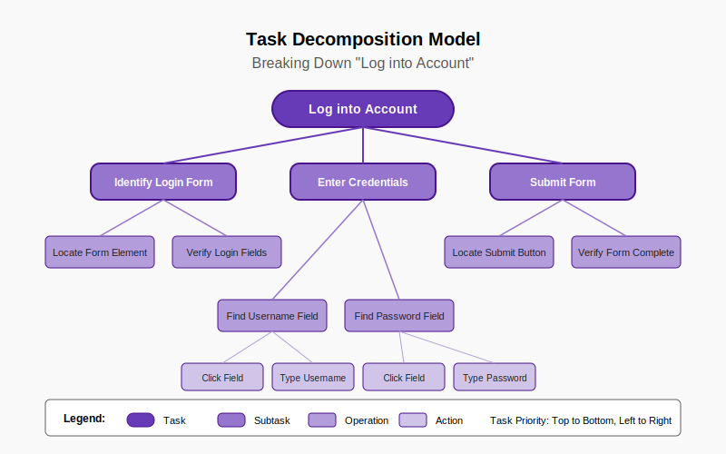

# The Generic User Approach: Training AI to Navigate Interfaces as Humans Do
> #### *Paul Hanchett with assistance from Anthropic Claude*

## Abstract

Current browser automation approaches rely on brittle DOM-based interactions or pure visual approaches that lack semantic understanding. This paper proposes the Generic User (GU) approach, a dual-AI architecture that enables AI systems to interact with web interfaces naturally, as humans do. By capturing and learning from authentic browser interactions, we demonstrate how a hierarchical system of specialized AI components can develop both low-level mechanics and high-level intent understanding. We present concrete data structures for training such systems, methods for task decomposition, element recognition, and sequence prediction, and suggest a hybrid training methodology that learns from both aggregated patterns and raw interactions. Our approach offers a robust, universal solution for AI-browser interaction that remains effective even as websites change.

## 1. Introduction

Enabling AI systems to interact with web applications as humans do represents a significant challenge in AI development. Current approaches to browser automation typically rely on one of two strategies: DOM-based interaction using tools like Selenium and Puppeteer (Selenium Project, n.d.) or pure visual approaches. Both suffer from fundamental limitations when applied to complex applications, particularly with dynamic web elements and changing layouts (ACCELQ, 2024).

As LambdaTest (2023) notes, "dynamic web elements can modify their attributes, positions, or visibility in response to user interactions or data updates." These challenges have led to brittle automation solutions that break whenever website layouts change. Recent innovations like Skyvern are addressing this by using "prompts in addition to computer vision and LLMs to parse items in the viewport in real-time" (Skyvern-AI, 2025), but these approaches still don't fully leverage the browser's own understanding of the page.

The key insight of the Generic User approach is elegantly simple: **We don't need to rebuild the browser's understanding of the page—we just need to access it.** A browser already solves the incredibly complex problem of converting HTML, CSS, and JavaScript into a visual representation with interactive elements. Rather than forcing an AI to rediscover this information, we can leverage the browser's own understanding, similar to how DeepLearning.AI (2025) describes AI browser agents using "both visual information, like screenshots, and structural data, like the HTML or Document Object Model (DOM) of a web page, to reason and take actions."

This paper makes several contributions:

1. Formalizing the Generic User architecture with specialized components
2. Presenting concrete data structures for capturing browser interactions
3. Demonstrating how different models (sequence prediction, task decomposition, element recognition) can be derived from interaction data
4. Proposing a hybrid training methodology that combines aggregated patterns with raw interactions

## 2. The Generic User Architecture

The GU approach employs a dual-AI system that mirrors human cognitive specialization:

### 2.1 The Browser Interaction Specialist

A specialized AI system trained specifically for browser interaction:
- Understands general UI patterns and interaction models
- Translates high-level intents into specific browser interactions
- Develops expertise in navigation patterns across different interface types
- Acts as an intermediary between domain-specific AI and the browser

### 2.2 The Domain Specialist

A separate AI focused on the task domain (healthcare, finance, etc.):
- Understands domain-specific knowledge and goals
- Makes decisions about what needs to be accomplished
- Communicates with the Browser Interaction Specialist through high-level intents
- Remains free from needing to understand browser interaction details

### 2.3 Technical Implementation Components

This dual-AI system requires:
1. A browser integration layer exposing the rendered page structure
2. A semantic mapping interface translating between browser representation and AI concepts
3. An action interface for issuing interaction commands
4. A visual context providing the rendered visual state

This approach provides a separation of concerns that mirrors human cognition: just as we have specialized brain regions for visual processing and motor control separate from higher-level reasoning, this architecture separates browser interaction expertise from domain expertise.

## 3. Training Data Collection and Structure

### 3.1 Browser Interaction Networks

Training data for a Generic User system comes from capturing real interactions between users and browsers. As BrowserStack (2025) notes, "The machine learning model is trained on a comprehensive dataset, including the codebase, application interface, logs, test cases, and specification documents. A large and diverse training dataset is essential for maximizing algorithm efficacy." In the context of browser automation, this means collecting authentic user interactions with web interfaces.

The data is structured as interaction networks that preserve the contextual relationships between actions, similar to how Skyvern-AI (2025) describes their "Action Recorder" functionality that "allows Skyvern to watch a user complete a task and then automatically generate a workflow for it."



As illustrated above, an interaction network captures:
- Page states (e.g., Login Page, Error Page, Dashboard)
- Interaction paths (Success, Error, Recovery)
- Data collection points where user actions are logged

This approach aligns with Beagle Security's observation that "a model is created by means of training and it requires lots of data. Before training, the data needs to be annotated and labeled, that allows the computer to look for patterns" (Beagle Security, n.d.). For browser interaction, these patterns include successful navigation paths, error recovery sequences, and common user behaviors.

### 3.2 Logged Data Structure

The logged data at each collection point captures the specific interactions, their timing, and their outcomes.



Each interaction session includes:
- Session identifier and metadata
- Starting page URL and timestamp
- Sequence of interactions (clicks, typing, form submissions)
- Outcomes of interactions (page transitions, success/failure)

InfoWorld (2025) describes the challenges of browser automation: "AI agents attempting web interactions encounter even more complex challenges. Most existing solutions lack the flexibility to autonomously navigate websites, interpret complex UI elements, and perform multi-step tasks without breaking." Our data structure addresses these challenges by capturing the complete context of successful interactions.

This data structure provides several advantages:
1. **Temporal relationships**: Capturing the sequence and timing of interactions
2. **Element properties**: Recording the types of elements interacted with
3. **Form submissions**: Identifying culmination points of interaction sequences
4. **Success signals**: Tracking whether interactions led to expected outcomes
5. **Value persistence**: Following entered values that appear in responses

Submit operations provide natural transaction boundaries, allowing the system to identify the completion of logical units of interaction.

### 3.3 Aggregation of Low-Level Actions

An important consideration is how to handle the aggregation of low-level actions (keystrokes, mouse movements) into higher-level intentions (typing a username, navigating to the next field).

We propose a hybrid approach that:
1. Pre-aggregates common patterns for initial training
2. Gradually introduces more granular data as training advances
3. Develops models that understand both levels of abstraction

This approach is consistent with BrowserStack's (2025) observation of AI-based test automation: "With regular tool usage, the training data accumulates, which enhances the accuracy and effectiveness of the machine learning models. This continuous feedback loop enables the AI system to learn and adapt, refining its capabilities over time."

The hybrid approach mirrors how humans develop expertise - starting with understanding high-level actions, then gaining a more nuanced understanding of their components, which is essential for what RWS (n.d.) describes as "responsible AI data that's targeted, accurate, and reliable to ensure ML model success."

## 4. Learning Models

From the interaction network data, we derive three primary models:

### 4.1 Sequence Prediction Model

This model predicts the next likely action based on the current state and previous interactions.



The sequence prediction model:
- Takes as input the current page state and previous actions
- Matches these against patterns in the interaction network
- Outputs the most likely next action with confidence scores

This enables the GU system to follow established interaction patterns and anticipate user behavior.

### 4.2 Task Decomposition Model

This model breaks down high-level tasks into hierarchical subtasks and specific actions.



The task decomposition model:
- Takes a high-level task (e.g., "Log into account")
- Decomposes it into subtasks (Identify form, Enter credentials, Submit form)
- Further breaks these down into specific operations and actions

This hierarchical approach allows the system to plan complex interactions and adapt to different interface layouts.

### 4.3 Element Recognition Model

This model identifies UI elements based on their visual appearance, position, and attributes.


The element recognition model:
- Analyzes page elements using both visual and DOM features
- Calculates confidence scores for different element types
- Identifies the most likely function of each element

By combining these three models, the GU system can effectively navigate web interfaces - recognizing elements, understanding how they relate to tasks, and executing appropriate interaction sequences.

## 5. Training Methodology

Training a Generic User system presents unique challenges that require a multi-stage approach.

### 5.1 Hybrid Training Approach

We propose a hybrid training methodology that combines:

1. **Supervised learning** from interaction networks of successful user sessions
2. **Reinforcement learning** to optimize for task completion efficiency
3. **Transfer learning** to generalize across different interfaces

### 5.2 Training Process

The training process follows these stages:

1. **Initial foundation**: Training on pre-aggregated interaction patterns to establish basic capabilities
2. **Progressive refinement**: Introducing raw interaction data to develop nuanced understanding
3. **Generalization training**: Exposing the system to diverse interfaces to build transferable skills
4. **Specialization**: Fine-tuning for specific domains or application types

### 5.3 Validation Challenges

Validating such a system requires evaluating:
- Cross-domain generalization to different types of websites
- Robustness to design changes
- Performance with novel interface patterns
- Success rate and efficiency metrics
- Error recovery capabilities

## 6. Comparison with Existing Approaches

The Generic User approach offers several advantages over current browser automation techniques, addressing many of the challenges identified in traditional methods.

Traditional DOM-based automation tools like Selenium face significant challenges with dynamic web elements. As ACCELQ (2024) notes, "automating web applications becomes challenging with Selenium since the locators available might fail to interact with the web elements." Additionally, "web content based on AJAX may take time to load, which is a possible reason for test script failure." These issues lead to brittle automation scripts that require constant maintenance.

The limitations of current approaches have led to the emergence of AI-based browser automation solutions. Azalio (2025) explains that "most existing solutions lack the flexibility to autonomously navigate websites, interpret complex UI elements, and perform multi-step tasks without breaking," noting that "even the best-performing AI models have a success rate of only 35.8% when attempting real-world web tasks."

Our Generic User approach offers several advantages over these existing techniques:

1. **Universality**: Works across any web application without application-specific programming, similar to how Skyvern-AI (2025) describes their tool as able to "operate on websites it's never seen before, as it's able to map visual elements to actions necessary to complete a workflow, without any customized code."

2. **Robustness to change**: Less sensitive to website updates by operating at the level of rendered elements rather than relying on "pre-determined XPaths or other selectors" (Skyvern-AI, 2025).

3. **Natural interaction**: Interacts with elements as they appear to users, following BrowserStack's (2024) recommendation that "Page Objects help create robust frameworks by resisting minor UI tweaks."

4. **Cognitive division of labor**: Separates browser expertise from domain expertise, similar to how DeepLearning.AI (2025) describes AI browser agents using "both visual information, like screenshots, and structural data, like the HTML or Document Object Model (DOM) of a web page, to reason and take actions."

5. **Scalable learning**: Builds generalized understanding of UI patterns that transfers across applications, addressing what Beagle Security (n.d.) describes as the need for ML algorithms that "work along with traditional web automation frameworks" to make systems "more efficient and reliable."

Recent "agentic browser" implementations like those described in the Awesome Browser Automation list (Angrykoala, n.d.) show a convergence toward similar ideas, indicating an industry recognition of the need for more human-like browser interaction models.

## 7. Future Directions

Several promising directions for future research include:

1. **Integration with multimodal AI**: Combining the GU approach with vision and language models
2. **Application beyond browsers**: Extending to mobile interfaces, desktop applications, and specialized systems
3. **Continuous learning**: Developing methods for ongoing improvement from user interactions
4. **Personalization**: Adapting to individual users' interaction preferences

## 8. Conclusion

The Generic User approach represents a fundamental shift in how AI systems interact with web interfaces. By learning from authentic human interactions and employing a specialized AI architecture, we eliminate an entire class of brittleness in AI automation while making interactions more human-like.

The separation of browser interaction expertise from domain expertise mirrors human cognitive specialization, allowing each AI component to excel in its respective domain. As we continue to develop AI systems that assist humans in complex tasks, this dual-AI architecture offers a critical pathway to making those systems more capable, more reliable, and more adaptable to the ever-changing digital landscape.

## Appendix A: Detailed Data Structures

```json
// Session Example: User Login
{
  "session_id": "login_example_001",
  "start_url": "example.com/login",
  "interactions": [
    {
      "id": "i1",
      "type": "click",
      "element": {"type": "input", "id": "username", "attributes": {"placeholder": "Username"}},
      "timestamp": "t1"
    },
    {
      "id": "i2",
      "type": "type",
      "value": "user123",
      "element_ref": "i1",
      "timestamp": "t2"
    },
    {
      "id": "i3",
      "type": "click",
      "element": {"type": "input", "id": "password", "attributes": {"type": "password"}},
      "timestamp": "t3"
    },
    {
      "id": "i4",
      "type": "type",
      "value": "[MASKED]",
      "element_ref": "i3",
      "timestamp": "t4"
    },
    {
      "id": "i5",
      "type": "click",
      "element": {"type": "button", "id": "submit", "text": "Sign In"},
      "timestamp": "t5"
    }
  ],
  "outcome": {
    "next_url": "example.com/dashboard",
    "success": true,
    "response_contains": ["Welcome user123", "Dashboard"]
  }
}
```

## Appendix B: Test Case Structure

```json
[
  {
    "test_id": "login_test_001",
    "description": "Successful login with valid credentials",
    "input": {
      "url": "example.com/login",
      "page_state": {
        "elements": [
          {"id": "username", "type": "input", "visible": true, "enabled": true},
          {"id": "password", "type": "password", "visible": true, "enabled": true},
          {"id": "submit", "type": "button", "text": "Sign In", "visible": true, "enabled": true}
        ]
      },
      "task": "Log in with username user123 and password pass456"
    },
    "expected_actions": [
      {"type": "click", "target": "username"},
      {"type": "type", "value": "user123"},
      {"type": "click", "target": "password"},
      {"type": "type", "value": "pass456"},
      {"type": "click", "target": "submit"}
    ],
    "expected_outcome": {
      "url_contains": "dashboard",
      "page_contains": "Welcome user123"
    }
  }
]
```

## References

1. Skyvern-AI. (2025). "Skyvern: Automate browser-based workflows with LLMs and Computer Vision." *GitHub Repository*. Retrieved from https://github.com/Skyvern-AI/skyvern

2. LambdaTest. (2023). "What Is Browser Automation: A Complete Tutorial." *LambdaTest Learning Hub*. Retrieved from https://www.lambdatest.com/learning-hub/browser-automation

3. Azalio. (2025). "Browser Use: An open-source AI agent to automate web-based tasks." *Azalio Blog*. Retrieved from https://www.azalio.io/browser-use-an-open-source-ai-agent-to-automate-web-based-tasks/

4. Beagle Security. (n.d.). "Machine Learning for Web Automation." *Beagle Security Blog*. Retrieved from https://beaglesecurity.com/blog/article/machine-learning-for-web-automation.html

5. DeepLearning.AI. (2025). "Building AI Browser Agents." *DeepLearning.AI Short Courses*. Retrieved from https://www.deeplearning.ai/short-courses/building-ai-browser-agents/

6. ACCELQ. (2024). "Selenium Automation Testing Challenges." *ACCELQ Blog*. Retrieved from https://www.accelq.com/blog/selenium-automation-testing-challenges/

7. BrowserStack. (2024). "Web Browser Automation using Selenium: Best Practices." *BrowserStack Guide*. Retrieved from https://www.browserstack.com/guide/selenium-web-browser-automation

8. Real Python. (2025). "Modern Web Automation With Python and Selenium." *Real Python Tutorial*. Retrieved from https://realpython.com/modern-web-automation-with-python-and-selenium/

9. Angrykoala. (n.d.). "Awesome Browser Automation: Curated list of awesome browser automation tools and resources." *GitHub Repository*. Retrieved from https://github.com/angrykoala/awesome-browser-automation

10. Selenium Project. (n.d.). "The Selenium Browser Automation Project." *Selenium Documentation*. Retrieved from https://www.selenium.dev/documentation/
