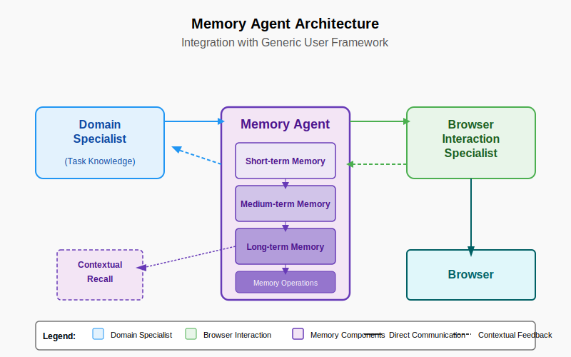

# The Memory Agent: Enhancing Browser Automation with Contextual Awareness

> #### *Paul Hanchett with assistance from Anthropic Claude*

## Abstract

This paper proposes the Memory Agent, an extension to the Generic User framework for AI-browser interaction. The Memory Agent serves as a dedicated system for maintaining contextual awareness across browsing sessions, storing interaction patterns, and providing relevant historical information to other agents in the system. We explore the potential architecture, implementation considerations, and benefits of incorporating such an agent into browser automation systems. The Memory Agent represents a step toward more human-like browsing capabilities by addressing the critical aspect of memory that enables humans to leverage past experiences when navigating interfaces.

## 1. Introduction

Human web browsing is characterized not only by the ability to interact with elements on a page but also by the capacity to remember previous interactions, recognize patterns, and apply learned behaviors across different websites. Current browser automation approaches, including the Generic User framework previously introduced, do not fully address this temporal dimension of interaction.

The Memory Agent concept addresses this gap by creating a dedicated component responsible for:
- Recording significant interactions and their outcomes
- Maintaining awareness of context across browsing sessions
- Providing relevant historical information to other agents in the system
- Enabling transfer learning from previous experiences to new situations

This paper explores the potential architecture, implementation considerations, and benefits of incorporating a Memory Agent into browser automation systems.

## 2. The Role of Memory in Human-Browser Interaction

Human web browsing relies heavily on memory at multiple levels:

### 2.1 Semantic Memory

Humans possess semantic memory about how websites typically function. For example, they understand that:
- Shopping carts typically have "checkout" buttons
- Login forms usually require usernames and passwords
- News websites typically have headlines and article links

### 2.2 Episodic Memory

Humans also maintain episodic memory about specific websites:
- "Last time I visited this site, I needed to click the hamburger menu to find settings"
- "This website required a captcha during registration"
- "The submit button on this form was located at the bottom of the page"

### 2.3 Procedural Memory

Procedural memory enables the execution of common browsing actions without conscious thought:
- Filling out forms
- Navigating menu systems
- Scrolling to find relevant information

The Memory Agent aims to provide analogous capabilities to an AI system, enabling it to build up similar forms of memory that enhance its browser interaction capabilities.

## 3. Memory Agent Architecture

### 3.1 Memory Organization

The Memory Agent would organize memories in a multi-tiered structure:

#### 3.1.1 Short-term Working Memory
- Contains information about the current browsing session
- Maintains awareness of recent actions and their outcomes
- Holds temporary context that may be relevant to immediate decisions
- Analogous to human working memory with limited capacity but high accessibility

#### 3.1.2 Medium-term Session Memory
- Records important events from recent browsing sessions
- Maintains website-specific interaction patterns
- Remembers successful paths to completing common tasks
- May be cleared or compressed after extended periods of inactivity

#### 3.1.3 Long-term Semantic Memory
- Stores generalized patterns about website categories
- Maintains knowledge about typical interface elements and their functions
- Develops understanding of common web interaction paradigms
- Persists across all sessions and grows over time

### 3.2 Content Structure

Each memory entry would contain:

```json
{
  "timestamp": "2025-05-06T14:32:45Z",
  "context": {
    "domain": "example.com",
    "page_type": "login",
    "task": "authenticate user"
  },
  "action": {
    "type": "form_submission",
    "elements": [
      {"id": "username", "value": "[USER]"},
      {"id": "password", "value": "[MASKED]"}
    ]
  },
  "outcome": {
    "success": true,
    "next_page": "dashboard",
    "response_elements": ["welcome_message", "account_menu"]
  },
  "importance": 0.85,
  "recall_count": 3,
  "last_accessed": "2025-05-10T09:15:22Z"
}
```

### 3.3 Memory Operations

The Memory Agent would support several key operations:

#### 3.3.1 Memory Recording
- Passive monitoring of all interactions between other agents
- Active recording of significant events (successes, failures, unusual responses)
- Metadata tagging for improved retrieval
- Privacy-preserving mechanisms for sensitive information

#### 3.3.2 Memory Consolidation
- Periodic review of short-term memories
- Identification of patterns and generalizations
- Compression of similar experiences
- Transfer of important information to long-term storage

#### 3.3.3 Memory Retrieval
- Context-based matching against current situation
- Relevance scoring for potential memories
- Multi-faceted search capabilities (by domain, action type, outcome, etc.)
- Confidence estimation for recalled information

#### 3.3.4 Memory Decay and Forgetting
- Importance-based retention policies
- Temporal decay for outdated information
- Conflict resolution for contradictory memories
- Active pruning of low-value entries

## 4. Integration with the Generic User Framework

### 4.1 Communication Patterns

The Memory Agent would interact with other components of the Generic User framework through several communication patterns:

#### 4.1.1 Query-based Access
Other agents explicitly request information:
```
Domain Agent: "Have we successfully logged into example.com before?"
Memory Agent: "Yes, using form #login-form with fields 'username' and 'password'. Last success on 2025-05-06."
```

#### 4.1.2 Proactive Suggestions
When the Memory Agent identifies highly relevant information:
```
Memory Agent: "Attention: The last three attempts to click the 'submit' button on this page failed. Suggest using the keyboard shortcut 'Enter' instead, which succeeded previously."
```

#### 4.1.3 Side Channel Notifications
Providing context without interrupting the main task flow:
```
[Main task: Filling out registration form]
[Memory sidebar: Similar registration forms on this domain required email verification]
```

#### 4.1.4 Background Enrichment
Adding historical context to actions:
```
Original command: "Log in to account"
Enhanced command: "Log in to account [previously successful on this site using username field #email rather than #username]"
```

### 4.2 Architecture Integration



The Memory Agent fits into the Generic User framework as a supporting service that enhances both the Domain Specialist and Browser Interaction Specialist:

- Provides the Domain Specialist with historical success patterns for specific websites
- Offers the Browser Interaction Specialist guidance on previously successful interaction strategies
- Maintains cross-session awareness that neither primary agent possesses individually
- Enables gradual improvement through accumulated experience

## 5. Implementation Considerations

### 5.1 Storage Technologies

Several technologies could support the Memory Agent's storage requirements:

- **Vector Databases**: For semantic similarity matching of experiences
- **Time-series Databases**: For temporal patterns and sequential interactions
- **Graph Databases**: For representing relationships between websites, elements, and interactions
- **Hybrid Approaches**: Combining multiple storage technologies for different types of memory

### 5.2 Retrieval Mechanisms

Efficient retrieval requires sophisticated mechanisms:

- **Embedding-based Retrieval**: Using semantic embeddings to find similar situations
- **Context-aware Ranking**: Prioritizing memories based on current situation
- **Multi-hop Reasoning**: Connecting related memories to derive new insights
- **Attention Mechanisms**: Focusing on the most relevant aspects of recalled memories

### 5.3 Privacy and Security

Important considerations for implementation include:

- **Data Minimization**: Storing only what's necessary for effective operation
- **Sensitive Data Handling**: Special protocols for credentials and personal information
- **User Control**: Mechanisms for users to view, edit, or delete stored memories
- **Memory Isolation**: Preventing cross-contamination between different users or contexts

## 6. Potential Applications

### 6.1 Enhanced Browser Automation

The Memory Agent enables more sophisticated browser automation by:

- Reducing the need to rediscover interaction patterns on frequently visited sites
- Adapting to changes in website structure based on historical patterns
- Providing early warning of potential issues based on past experiences
- Improving efficiency through learned shortcuts and optimizations

### 6.2 Personalized Web Assistants

When incorporated into personal web assistants, the Memory Agent can:

- Remember user preferences across different websites
- Recall past successful strategies for completing tasks
- Provide personalized guidance based on individual browsing history
- Adapt to changing user needs and preferences over time

### 6.3 Testing and Quality Assurance

In QA contexts, the Memory Agent offers:

- Historical tracking of website behavior changes
- Early detection of regressions based on expected interactions
- More efficient test coverage by focusing on areas that have changed
- Accumulated knowledge about edge cases and failure modes

## 7. Challenges and Limitations

Several challenges must be addressed in implementing a Memory Agent:

### 7.1 Memory Reliability

- Distinguishing between reliable and unreliable memories
- Handling contradictions in remembered experiences
- Adapting to websites that change frequently
- Preventing the propagation of errors through false memories

### 7.2 Resource Requirements

- Managing storage requirements for extensive browsing histories
- Balancing memory operations with primary browsing tasks
- Scaling to accommodate growing memory stores
- Optimizing retrieval performance for real-time assistance

### 7.3 Overfitting

- Avoiding over-reliance on specific past experiences
- Generalizing appropriately across different websites
- Recognizing when historical patterns no longer apply
- Balancing exploitation of known patterns with exploration of new approaches

## 8. Future Research Directions

Several promising research directions emerge from the Memory Agent concept:

### 8.1 Memory Consolidation Algorithms

Developing efficient algorithms for:
- Identifying significant patterns across browsing sessions
- Compressing similar experiences without losing important details
- Generalizing from specific instances to broader principles
- Prioritizing memories based on utility and relevance

### 8.2 Cross-domain Transfer Learning

Exploring how learning from one website can enhance interactions with others:
- Identifying common patterns across different websites
- Transferring interaction strategies between similar interfaces
- Abstracting high-level navigation concepts from specific instances
- Developing domain-general browsing expertise

### 8.3 Collaborative Memory Systems

Investigating the potential for shared memories across users or agents:
- Privacy-preserving mechanisms for memory sharing
- Consensus building from diverse experiences
- Trust models for external memory sources
- Collaborative filtering for memory relevance

## 9. Conclusion

The Memory Agent represents a significant advancement in browser automation by addressing the temporal dimension of web interaction. By maintaining awareness across browsing sessions, storing interaction patterns, and providing contextual information to other agents, it enables more human-like browsing capabilities.

The integration of a Memory Agent into the Generic User framework would enhance both the Domain Specialist and Browser Interaction Specialist, allowing them to learn from past experiences and adapt to changing websites. This approach moves browser automation beyond simple task execution toward a more adaptive, learning-oriented paradigm.

Future work should focus on developing efficient storage and retrieval mechanisms, addressing privacy and security concerns, and exploring collaborative memory approaches that could further enhance the capabilities of AI-driven browser automation.

## References

1. Beagle Security. (n.d.). "Machine Learning for Web Automation." Retrieved from https://beaglesecurity.com/blog/article/machine-learning-for-web-automation.html

2. BrowserStack. (2025). "Machine Learning for Automation Testing." Retrieved from https://www.browserstack.com/guide/machine-learning-for-automation-testing

3. InfoWorld. (2025). "Browser Use: An open-source AI agent to automate web-based tasks." Retrieved from https://www.infoworld.com/article/3812644/browser-use-an-open-source-ai-agent-to-automate-web-based-tasks.html

4. Skyvern-AI. (2025). "Skyvern: Automate browser-based workflows with LLMs and Computer Vision." GitHub Repository. Retrieved from https://github.com/Skyvern-AI/skyvern

5. RWS. (n.d.). "AI Training Data for ML Models and AI Applications, TrainAI." Retrieved from https://www.rws.com/artificial-intelligence/train-ai-data-services/
