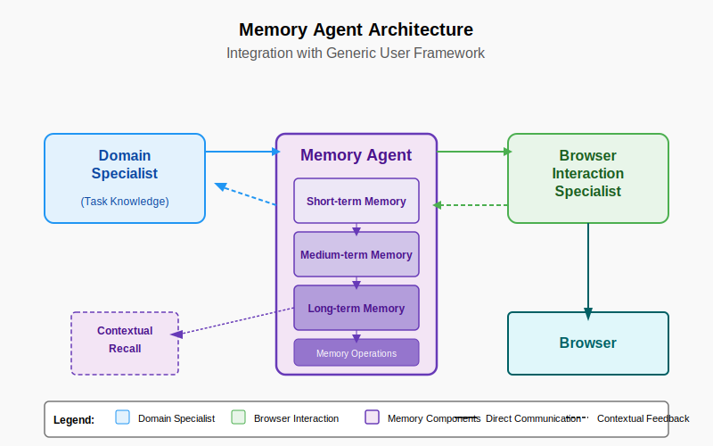

# The Memory Agent: A Multi-Purpose Component for AI Systems

> #### *Paul Hanchett with assistance from Anthropic Claude*

## Abstract

This paper proposes the Memory Agent as a specialized component for AI systems that addresses critical limitations in current architectures. By providing contextual awareness across multiple time scales and interaction types, the Memory Agent enables capabilities ranging from improved browser automation to personalized user experiences without compromising privacy or requiring extensive retraining. We explore practical applications including cross-conversation recall, browser interaction optimization, and privacy-preserving personalization, along with a technical architecture based on the software integrated circuit philosophy. The Memory Agent represents a shift away from monolithic AI systems toward modular, composable architectures with clear responsibilities and interfaces.

## 1. Introduction

Current AI systems face a fundamental challenge: they must either reprocess their entire context with each interaction or integrate user-specific information directly into their training data. Both approaches have significant limitations - the former is inefficient, while the latter raises privacy concerns and complicates model updating. These challenges manifest in different domains, from browser automation to personalized assistants.

The key insight of the Memory Agent approach is elegantly simple: **By creating a specialized component dedicated to memory functions, we can separate what an AI knows from how it processes that knowledge.** This separation allows for personalized, context-aware interactions without compromising core AI capabilities or privacy.

This paper makes several contributions:

1. Defining the Memory Agent as a modular, multi-purpose component in AI architectures
2. Presenting concrete applications with immediate practical benefits
3. Proposing an implementation architecture based on the software integrated circuit concept
4. Exploring how this approach addresses privacy, personalization, and model updating challenges

## 2. Core Applications

The Memory Agent addresses several immediate practical needs across different domains:

### 2.1 Cross-Conversation Memory

Perhaps the most compelling immediate application is enabling AI systems to maintain awareness across multiple conversations with the same user. This solves a significant limitation in current systems where each conversation exists in isolation.

**Current Challenge**: Users must repeatedly provide the same context in each new conversation, leading to frustration and inefficiency.

**Memory Agent Solution**: By maintaining a persistent store of key facts, preferences, and interaction patterns specific to each user, the Memory Agent allows an AI to recall:
- Previously established facts about the user (preferences, background, goals)
- Past discussions and their conclusions
- Ongoing projects and their status
- User-specific terminology and references

This capability drastically improves user experience by reducing repetition and creating a sense of continuity, without requiring every fact to be included in each conversation's context window.

### 2.2 Browser Interaction Optimization

Building on the Generic User framework, the Memory Agent enables more efficient browser automation by remembering successful interaction patterns.

**Current Challenge**: Browser automation systems must repeatedly rediscover how to interact with frequently visited websites, even when the interface hasn't changed.

**Memory Agent Solution**: By recording successful navigation paths, form completion patterns, and error recovery strategies, the Memory Agent allows automation systems to:
- Reuse proven interaction patterns for frequently visited sites
- Adapt quickly when websites change by recognizing what's different
- Learn from both successes and failures to improve over time
- Transfer knowledge between similar interfaces

This application greatly enhances the efficiency of the Browser Interaction Specialist in the Generic User framework by reducing redundant exploration of familiar interfaces.

### 2.3 Privacy-Preserving Personalization

The Memory Agent enables personalization without requiring sensitive information to be included in model training data.

**Current Challenge**: Including personal information in training data raises serious privacy concerns and creates challenges for model updates.

**Memory Agent Solution**: By storing personal information in a separate memory system that interfaces with the core AI, the Memory Agent:
- Keeps sensitive data separate from training data
- Allows users to control what is remembered and forgotten
- Preserves personalization across model updates
- Enables conditional access to different categories of personal information

This approach provides a technological solution to the tension between personalization and privacy, allowing AI systems to be both personal and privacy-preserving.

### 2.4 Contextual Resource Retrieval

The Memory Agent can proactively identify relevant information from previous interactions or external sources.

**Current Challenge**: Users must explicitly reference previous information or request specific resources.

**Memory Agent Solution**: By monitoring the current conversation and connecting it to historical context, the Memory Agent can:
- Suggest relevant previous discussions when similar topics arise
- Surface pertinent facts that the user may have forgotten
- Connect related projects or ideas across different conversations
- Provide continuity for long-term projects spanning multiple sessions

This capability makes AI assistance more proactive and context-aware, similar to how a human collaborator might remind you of relevant past discussions.

## 3. Memory Agent Architecture

The Memory Agent follows the software integrated circuit philosophy, providing well-defined functionality with clear interfaces to other system components.

### 3.1 Memory Organization

The Memory Agent organizes information in a multi-tiered structure:

#### 3.1.1 Short-term Working Memory
- Contains information about the current session or conversation
- Maintains awareness of recent actions and statements
- Holds temporary context that may be relevant to immediate decisions
- Analogous to human working memory with limited capacity but high accessibility

#### 3.1.2 Medium-term Session Memory
- Records important events from recent sessions
- Maintains conversation-specific context
- Remembers successful interaction patterns
- May be cleared or compressed after extended periods of inactivity

#### 3.1.3 Long-term Semantic Memory
- Stores user-specific facts, preferences, and established knowledge
- Maintains cross-session awareness of ongoing projects
- Develops understanding of user interaction patterns
- Persists indefinitely unless explicitly forgotten

### 3.2 Memory Operations

The Memory Agent supports several key operations:

#### 3.2.1 Recording
- Passive monitoring of conversations and interactions
- Active recording of significant events, facts, and decisions
- Metadata tagging for improved retrieval
- Privacy-preserving mechanisms for sensitive information

#### 3.2.2 Consolidation
- Periodic review of short-term memories
- Identification of patterns and important information
- Compression of similar experiences
- Transfer of important information to long-term storage

#### 3.2.3 Retrieval
- Context-based matching against current situation
- Two primary trigger types:
  - Recognition-based: "This looks like input I've seen before, where might it lead?"
  - Goal-oriented: "I've got this goal, have I seen how to get there before?"
- Relevance scoring for potential memories
- Multi-faceted search capabilities

#### 3.2.4 Decay and Forgetting
- Importance-based retention policies
- Temporal decay for outdated information
- Explicit forgetting mechanisms for user control
- Active pruning of low-value entries

### 3.3 Integration with AI Systems

The Memory Agent interfaces with other AI components through standardized protocols:

As shown in the diagram, the Memory Agent:
- Accepts memory recording requests from other components
- Provides relevant contextual information when requested
- Proactively suggests relevant memories when appropriate
- Offers side-channel insights without disrupting primary tasks

This architecture allows the Memory Agent to work with various AI systems while maintaining its independence and clear responsibilities.

## 4. Expected Benefits

The Memory Agent approach offers several concrete benefits that address current limitations in AI systems:

### 4.1 Immediate Practical Gains

1. **Reduced repetition**: Users no longer need to restate preferences, goals, or context in each conversation
2. **Improved task continuity**: Long-term projects can span multiple sessions without losing context
3. **More efficient interactions**: The system remembers what worked before rather than rediscovering solutions
4. **Enhanced personalization**: The AI can tailor responses based on known user preferences without asking repeatedly
5. **Better error handling**: Remembering past failures allows the system to avoid repeating mistakes

### 4.2 Architectural Advantages

1. **Separation of concerns**: Memory functions are isolated from core reasoning capabilities
2. **Maintainability**: The memory component can be updated independently of other system elements
3. **Privacy protection**: Personal data remains separate from the main AI model
4. **Update resilience**: User-specific information persists across model updates
5. **Scalability**: Memory can be expanded or optimized without affecting other components
6. **Auditability**: Memory operations can be logged and reviewed independently

### 4.3 User Experience Improvements

1. **Continuity**: Interactions feel connected across multiple conversations
2. **Familiarity**: The system demonstrates knowledge of user preferences and history
3. **Efficiency**: Less time spent reestablishing context
4. **Personalization**: Responses better tailored to individual needs
5. **Control**: Users can manage what is remembered or forgotten

## 5. Implementation Considerations

### 5.1 Storage Technologies

Several technologies could support the Memory Agent's storage requirements:

- **Vector Databases**: For semantic similarity matching of experiences
- **Graph Databases**: For representing relationships between facts and concepts
- **Time-series Databases**: For temporal patterns and sequential interactions
- **Hybrid Approaches**: Combining technologies for different memory types

### 5.2 Retrieval Mechanisms

Efficient retrieval requires sophisticated mechanisms:

- **Embedding-based Retrieval**: Using semantic embeddings to find similar situations
- **Context-aware Ranking**: Prioritizing memories based on current situation
- **Multi-hop Reasoning**: Connecting related memories to derive new insights
- **Attention Mechanisms**: Focusing on the most relevant aspects of recalled memories

### 5.3 Privacy and Security

Important considerations for implementation include:

- **Data Minimization**: Storing only what's necessary for effective operation
- **Sensitive Data Handling**: Special protocols for credentials and personal information
- **User Control**: Mechanisms for users to view, edit, or delete stored memories
- **Memory Isolation**: Preventing cross-contamination between different users or contexts

### 5.4 Integration Interfaces

Clear APIs for other components to interact with the Memory Agent:

- **Recording API**: For storing new memories and facts
- **Query API**: For retrieving relevant information
- **Suggestion API**: For proactive memory recommendations
- **Management API**: For controlling retention policies and forgetting

## 6. Comparison with Existing Approaches

The Memory Agent approach offers several advantages over current memory handling in AI systems:

1. **Context Window Expansion**: Some systems address memory limitations by increasing the context window size. While helpful, this approach still requires reprocessing the entire context with each interaction and has hard limits.

2. **Fine-tuning on Personal Data**: Other approaches use personal data for model fine-tuning. This creates privacy concerns and makes model updates challenging.

3. **External Knowledge Bases**: Some systems interface with external knowledge bases. While similar to the Memory Agent concept, these typically focus on factual knowledge rather than personal context and interaction patterns.

4. **Conversation History Storage**: Simple approaches store conversation history for reference. These lack the intelligent consolidation, retrieval, and proactive suggestion capabilities of the Memory Agent.

The Memory Agent approach is distinguished by its comprehensive memory architecture, clear separation from core AI components, and multi-purpose application across different domains.

## 7. Future Directions

Several promising research directions emerge from the Memory Agent concept:

1. **Collective Memory Systems**: Exploring how memories could be selectively shared across users while maintaining privacy
2. **Meta-memory Capabilities**: Developing awareness of memory reliability and confidence
3. **Cross-domain Transfer**: Applying lessons from one domain (e.g., web browsing) to others
4. **Memory Consolidation Algorithms**: Creating more sophisticated approaches to identifying important information
5. **Forgetting Mechanisms**: Developing better approaches to removing outdated or irrelevant information

## 8. Conclusion

The Memory Agent represents a significant advancement in AI system architecture by addressing the critical function of memory as a separate, specialized component. By following the software integrated circuit philosophy, it provides well-defined capabilities with clear interfaces that can serve multiple applications simultaneously.

This approach offers immediate practical benefits across several domains, from improving browser automation to enabling cross-conversation awareness and privacy-preserving personalization. Perhaps most importantly, it represents a shift away from monolithic AI architectures toward more modular, composable systems that better align with both human cognitive organization and sound software engineering principles.

As AI systems become more integrated into our daily lives, the ability to maintain contextual awareness while respecting privacy becomes increasingly important. The Memory Agent provides a technical architecture that addresses these challenges while offering a path toward more personalized, efficient, and privacy-preserving AI interactions.

## References

1. Beagle Security. (n.d.). "Machine Learning for Web Automation." Retrieved from https://beaglesecurity.com/blog/article/machine-learning-for-web-automation.html

2. BrowserStack. (2025). "Machine Learning for Automation Testing." Retrieved from https://www.browserstack.com/guide/machine-learning-for-automation-testing

3. InfoWorld. (2025). "Browser Use: An open-source AI agent to automate web-based tasks." Retrieved from https://www.infoworld.com/article/3812644/browser-use-an-open-source-ai-agent-to-automate-web-based-tasks.html

4. Skyvern-AI. (2025). "Skyvern: Automate browser-based workflows with LLMs and Computer Vision." GitHub Repository. Retrieved from https://github.com/Skyvern-AI/skyvern

5. RWS. (n.d.). "AI Training Data for ML Models and AI Applications, TrainAI." Retrieved from https://www.rws.com/artificial-intelligence/train-ai-data-services/
